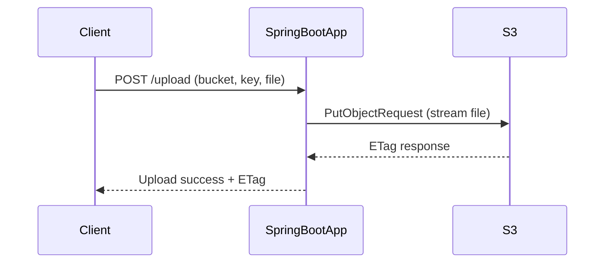

# Spring Boot AWS S3 File Upload

A simple Spring Boot application to upload files to an Amazon S3 bucket using the AWS SDK for Java (v2).

---

## How It Works

1. **Send a POST request** to `/upload` with:
   - Query parameters:
     - `bucket` → S3 bucket name
     - `key` → Object key (path + filename in bucket)
   - File parameter: `file` (multipart file)
2. The backend uses the AWS SDK `S3Client` to stream the file directly to S3.
3. S3 stores the file and returns an **ETag** as confirmation.

---

## Upload Flow Diagram



---

## Project Structure

- **`S3Controller`** – Handles `/upload` endpoint.
- **`S3Service`** – Upload logic with AWS SDK.
- **`StorageConfig`** – Configures `S3Client` with region and credentials.

---

## Requirements

- Java 17+
- AWS S3 bucket
- IAM user/role with `s3:PutObject` permission
- Environment variables set:
  ```bash
  export AWS_ACCESS_KEY_ID=your_access_key
  export AWS_SECRET_ACCESS_KEY=your_secret_key
  ```

---

## Run Locally

1. Clone the repo and navigate into it:
   ```bash
   git clone <your-repo-url>
   cd <your-repo-folder>
   ```
2. Set AWS credentials as environment variables:
   ```bash
   export AWS_ACCESS_KEY_ID=your_access_key
   export AWS_SECRET_ACCESS_KEY=your_secret_key
   ```
3. Start the application:
   ```bash
   ./mvnw spring-boot:run
   ```
4. Send a request:
   ```bash
   curl -X POST "http://localhost:8080/upload?bucket=your-bucket&key=folder/file.txt"         -F "file=@/path/to/local/file.txt"
   ```

---

## Example Response

```
Upload success. ETag: "d41d8cd8f0b204e9800998ecf8e"
```

---

## Notes

- Default region is **`us-east-2`** (change in `StorageConfig` if needed).
- Use Spring Boot's `spring.servlet.multipart.max-file-size` in `application.properties` to change file size limits.
- For production:
  - Prefer IAM roles or `DefaultCredentialsProvider`.
  - Validate and sanitize inputs.
  - Enable server-side encryption.

---
